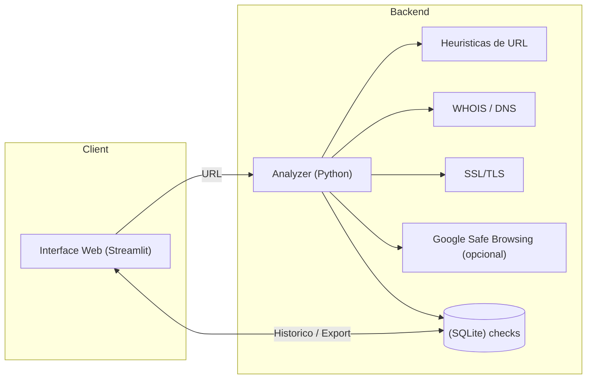

# Phish Detector - *Avaliacao Final*
**Disciplina:** Tecnologias Hacker  
**Autor:** Camila Consentino  
**Data:** Novembro de 2025  

---
### Video da ferramenta funcionando: https://youtu.be/j_AhZG6-Vco 
---

## Objetivo do Sistema

O **Phish Detector** é uma aplicação web desenvolvida em **Streamlit** que analisa URLs e estima a probabilidade de serem maliciosas, com foco em **detecção de phishing**.  
O sistema combina heurísticas baseadas em regras, análise de metadados de rede e consulta opcional ao **Google Safe Browsing API**, produzindo um **score de 0 a 100** e um **veredito textual** (*Seguro*, *Suspeito* ou *Malicioso*).

---

## Arquitetura 

O sistema é composto por quatro módulos principais:

1. **Interface (Streamlit)** — entrada de URL, exibição do veredito e histórico.  
2. **Analyzer (Python)** — coleta de features, execução de heurísticas e cálculo do score.  
3. **Banco SQLite** — registro de consultas e resultados.  
4. **Exportação / Relatórios** — geração de CSV, JSONL e relatório técnico.

**Diagrama:**  

---

## Heurísticas e Features Utilizadas

| Categoria | Feature | Descrição |
|------------|----------|-----------|
| **Estrutura da URL** | `has_ip`, `has_at_symbol`, `punycode`, `suspicious_tld`, `length`, `num_subdomains` | Detecta uso de IP, símbolos @, domínios punycode, TLDs suspeitas e URLs muito longas. |
| **Rede e Redirects** | `redirect_chain_len`, `final_status` | Mede quantidade de redirecionamentos e código HTTP final. |
| **Segurança (SSL)** | `ssl_has_cert`, `ssl_valid_until`, `ssl_issuer`, `ssl_hostname_match` | Verifica se há certificado SSL válido e compatível. |
| **Domínio (WHOIS)** | `domain_age_days` | Calcula a idade do domínio em dias. |
| **Similaridade com Marcas** | `closest_brand`, `closest_brand_score` | Mede a semelhança do domínio com marcas conhecidas (Google, PayPal, Apple etc.). |
| **Listas Negras** | `google_safe` | Integração opcional com Google Safe Browsing API. |

---

## Cálculo do Score (0 – 100)

- O score inicia em **100 pontos**.  
- Penalidades são aplicadas conforme evidências de risco.  
- O valor final é limitado ao intervalo [0, 100].

| Faixa | Veredito | Interpretação |
|--------|-----------|---------------|
| **0 – 29** | 🚨 Malicioso | Evidências fortes de phishing. |
| **30 – 69** | ⚠️ Suspeito | Características parcialmente duvidosas. |
| **70 – 100** | 🟢 Seguro | Nenhum sinal relevante de phishing. |

---

## Exemplos de URLs Testadas

| URL | Score | Veredito | Observações |
|------|--------|-----------|-------------|
| https://www.google.com | 95 | 🟢 Seguro | Certificado válido e domínio antigo. |
| http://93.184.216.34/login | 25 | 🚨 Malicioso | Uso de IP + sem SSL. |
| http://xn--ppal-5ve.com/login | 20 | 🚨 Malicioso | Punycode imitando PayPal. |
| https://accounts-google.com/signin | 40 | ⚠️ Suspeito | Domínio similar a Google. |
| https://testsafebrowsing.appspot.com/apiv4/ANY_PLATFORM/MALWARE/URL/ | 0 | 🚨 Malicioso | Detectado pelo Google Safe Browsing. |

---

## Histórico de Consultas

O sistema mantém um registro local (SQLite `phish_detector.db`) contendo:
- URL analisada  
- Data / hora (UTC)  
- Score e veredito  
- Principais features  

O histórico é exibido na interface e pode ser **exportado** em:
- CSV (resumo tabular)  
- JSONL (detalhes completos + features)

---

## Exportação 

O módulo de exportação gera automaticamente:
- `phish_history_YYYYMMDD.csv`  
- `phish_history_YYYYMMDD.jsonl`  